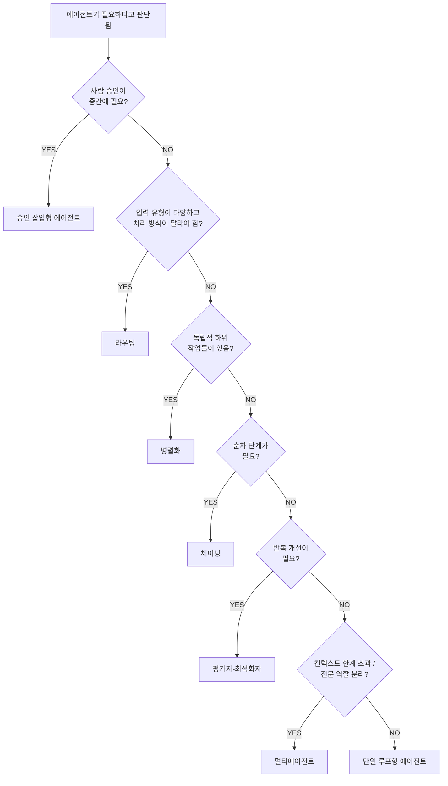

## 최적 패턴 선택 의사결정 트리

## 복잡도 비용표

| 패턴 | 구현 복잡도 | 디버깅 난이도 | 비용 | 권장 순서 |
|------|-----------|-------------|------|---------|
| 단일 루프 | ★☆☆ | ★☆☆ | 낮음 | 1순위 |
| 체이닝 | ★★☆ | ★★☆ | 낮음 | 2순위 |
| 라우팅 | ★★☆ | ★★☆ | 낮음 | 2순위 |
| 병렬화 | ★★☆ | ★★★ | 중간 | 3순위 |
| 평가자-최적화자 | ★★★ | ★★★ | 높음 | 3순위 |
| 오케스트레이터-워커 | ★★★ | ★★★ | 높음 | 4순위 |
| 그룹챗 | ★★★ | ★★★ | 매우높음 | 마지막 |

## 안티패턴: Over-agentification


**가장 흔한 실수**: 단순한 문제에 복잡한 에이전트를 도입하는 것


**이런 경우 에이전트가 필요 없습니다**
- 단순 FAQ 응답 → RAG 검색 + 챗봇으로 충분
- 정해진 순서의 자동화 → 코드/RPA로 충분
- 단일 LLM 호출로 해결 → 에이전트 루프 불필요
- 실시간 응답 필요 → 에이전트의 여러 LLM 호출이 지연 유발
