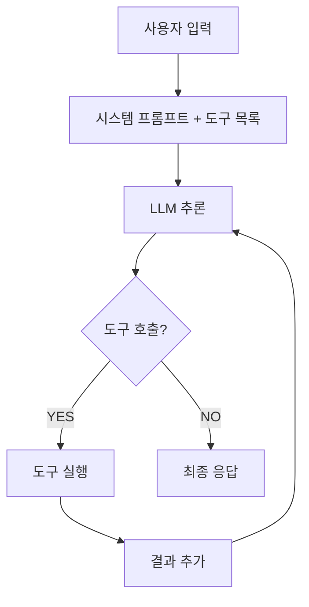
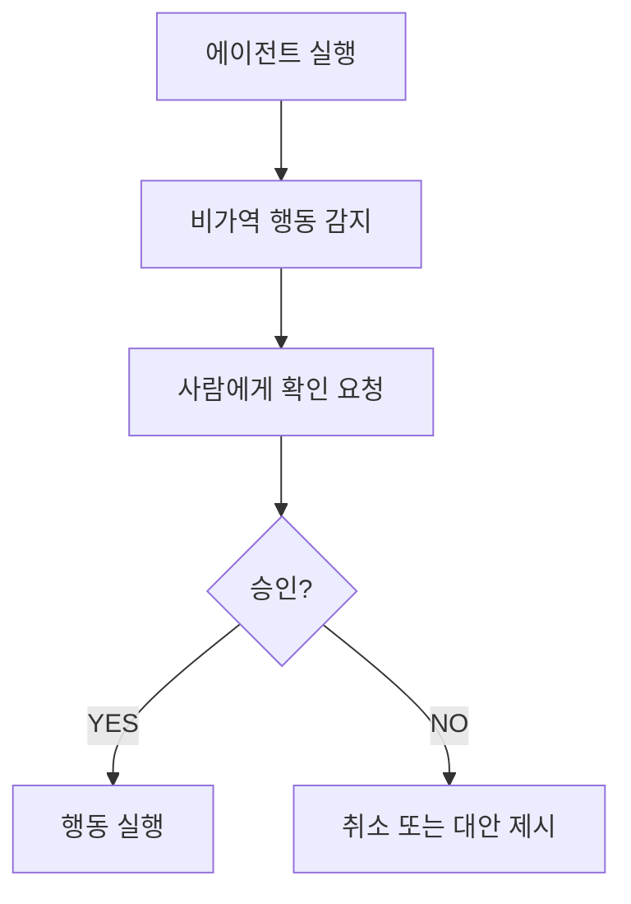

## 올바른 시작: 단일 에이전트 + MCP 도구

대부분의 신규 에이전트 프로젝트에서 **단일 에이전트 + MCP 도구**가 올바른 시작 아키텍처입니다.


복잡성을 추가하는 것은 언제든 할 수 있습니다. 하지만 단순하게 시작해서 실제로 복잡성이 필요한 부분을 파악하는 것이 훨씬 낫습니다.


## 패턴 1: 단일 루프형 에이전트



**적합한 상황**
- 단일 목표를 달성하는 자율 작업
- 도구를 선택적으로 사용하며 목표까지 진행
- 중간 승인 없이 완료까지 실행

## 패턴 2: 툴 호출형 에이전트 (Tool Use)

**도구 설계 원칙** (Anthropic 권장)
1. **단일 책임**: 각 도구는 하나의 명확한 기능만 수행
2. **명확한 계약**: 파라미터·반환값을 JSON Schema로 정확히 명세
3. **오류 처리**: 실패 시 에이전트가 이해 가능한 오류 메시지 반환
4. **멱등성**: 같은 도구를 여러 번 호출해도 안전한지 고려

```json
{
  "name": "search_documents",
  "description": "내부 지식 베이스에서 관련 문서를 검색합니다",
  "parameters": {
    "query": {
      "type": "string",
      "description": "검색어"
    },
    "limit": {
      "type": "integer",
      "description": "반환할 최대 결과 수",
      "default": 5
    }
  }
}
```

## 패턴 3: 승인 삽입형 에이전트 (Human-in-the-Loop)

**언제 사용**: 비가역적 행동(이메일 발송, DB 수정, 결제 처리) 전



**HITL 설계 체크리스트**
- [ ] 어떤 행동이 승인을 요구하는지 명확히 정의
- [ ] 승인 요청 시 충분한 컨텍스트 제공 (에이전트 추론 + 예상 결과)
- [ ] 승인/거부 외 "수정 후 재시도" 옵션 제공
- [ ] 승인 이력 저장 (감사 추적)
- [ ] 타임아웃 처리 (무한 대기 방지)
