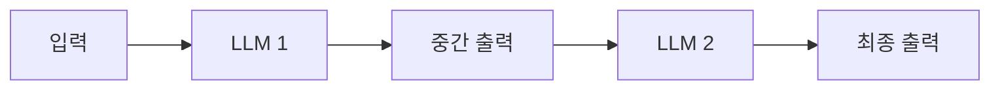
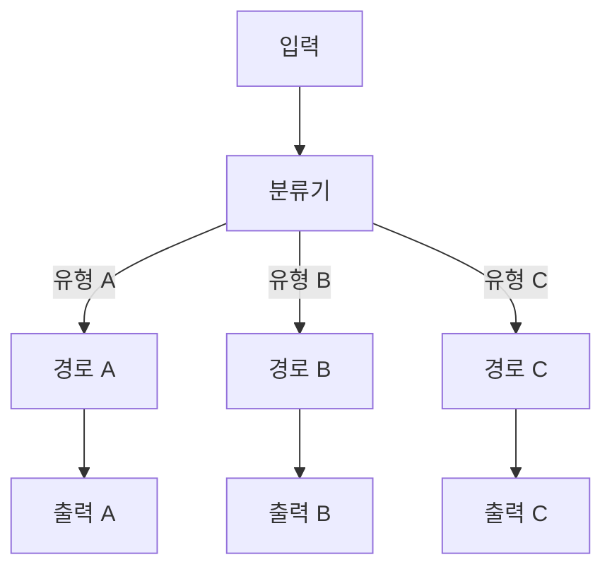
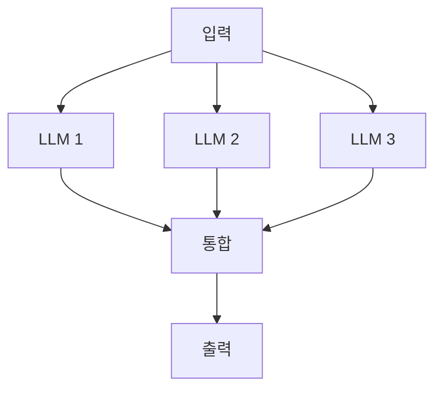
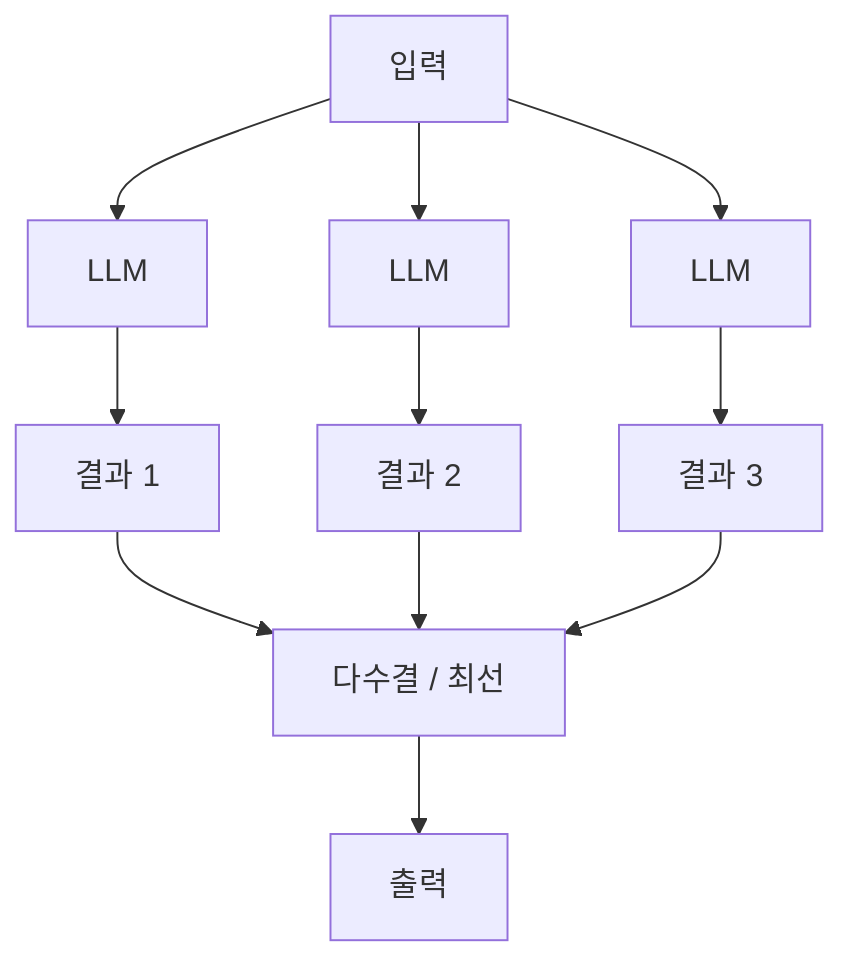
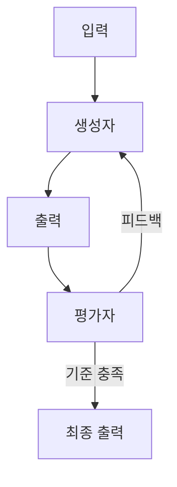

Anthropic이 권장하는 핵심 워크플로우 패턴 4가지입니다. **단순성을 최우선**으로 선택하세요.

## 1. 체이닝 (Prompt Chaining)

**정의**: 한 LLM 출력이 다음 LLM 입력이 되는 순차 파이프라인

**언제 사용**
- 복잡한 작업을 더 작고 정확한 단계로 분해할 때
- 각 단계가 이전 단계의 품질에 의존할 때
- 체크포인트(게이트)를 통해 파이프라인을 제어해야 할 때

**예시**: 문서 요약 → 핵심 포인트 추출 → 슬라이드 초안 생성

## 2. 라우팅 (Routing)

**정의**: 입력을 분류하고, 유형에 따라 다른 처리 경로로 보내는 패턴

**언제 사용**
- 입력 유형이 다양하고, 각 유형에 최적화된 처리가 다를 때
- 모델 크기/비용을 최적화할 때 (단순 쿼리 → 소형 모델, 복잡 쿼리 → 대형 모델)

**예시**: CS 티켓 → 유형 분류 → 기술 문의/환불 요청/불만 각각 다른 에이전트

## 3. 병렬화 (Parallelization)

**정의**: 여러 작업을 동시에 실행하여 성능을 높이는 패턴

**두 가지 변형**

**섹셔닝**: 독립적인 하위 작업으로 분리

**투표/검증**: 같은 작업을 여러 번 실행해 결과 검증

**언제 사용**
- 작업이 독립적인 부분으로 분리 가능할 때
- 높은 신뢰도가 필요해 다중 검증이 필요할 때

## 4. 평가자-최적화자 (Evaluator-Optimizer)

**정의**: 한 LLM이 출력을 생성하고, 다른 LLM이 평가·피드백하며 반복 개선

**언제 사용**
- 명확한 품질 기준이 있고, 개선 반복이 유효할 때
- 초안 → 검토 → 수정 사이클이 필요한 창의적 작업


**반복 횟수 제한**: 무한 루프를 방지하기 위해 항상 최대 반복 횟수를 설정하세요.


## 패턴 선택 빠른 참조

| 상황 | 추천 패턴 |
|------|---------|
| 단계별 순차 처리 필요 | 체이닝 |
| 입력 유형이 다양함 | 라우팅 |
| 독립 작업이 많음 / 속도 중요 | 병렬화 |
| 반복 개선 필요 | 평가자-최적화자 |
