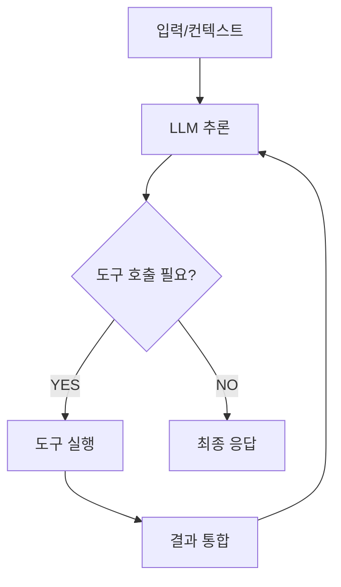

## 핵심 개념 비교

AI 시스템을 도입할 때 가장 먼저 해야 할 일은 **무엇을 만들지 정확히 구분하는 것**입니다.

| 구분 | 정의 | 판단 주체 | 예시 |
|------|------|-----------|------|
| **챗봇** | 규칙 또는 LLM 기반 대화 응답 | 없음 (반응형) | FAQ 봇, CS 응답 봇 |
| **워크플로우** | 미리 정의된 단계를 자동으로 실행 | 없음 (결정론적) | 데이터 파이프라인, RPA |
| **단일 에이전트** | LLM이 스스로 도구를 선택·실행하며 목표를 달성 | 에이전트 | 코딩 도우미, 리서치 에이전트 |
| **멀티에이전트** | 여러 에이전트가 협력하여 복잡한 목표를 달성 | 오케스트레이터 + 워커 | 복잡 업무 자동화 |

## 에이전트 루프 (Agent Loop)

에이전트는 **인지 → 추론 → 행동** 사이클을 반복합니다.

## 에이전트가 할 수 있는 일 / 없는 일


**에이전트가 가장 잘 하는 일**: 다단계 판단이 필요하고, 실행 중 상태를 유지해야 하며, 여러 도구를 순서대로 또는 병렬로 사용해야 하는 업무


**할 수 있는 일**
- 비정형 문서를 읽고 구조화된 결과 추출
- 여러 시스템에 걸쳐 멀티스텝 업무 처리
- 애매한 상황에서 맥락 기반 판단
- 긴 작업 중 오류를 감지하고 자가 수정

**하기 어려운 일**
- 실시간 초저지연 응답 (< 100ms)
- 100% 결정론적 출력 보장
- 규칙 기반으로 해결되는 단순 자동화
- 라이선스·컴플라이언스 제약이 강한 완전 자율 의사결정

## 핵심 원칙: 단순하게 시작하라


Anthropic, OpenAI 모두 공통적으로 강조합니다: **먼저 단순한 워크플로우로 문제를 풀 수 있는지 검토하세요.** 에이전트의 복잡성은 항상 비용입니다.


**올바른 시작 아키텍처**: 단일 에이전트 + MCP 도구

복잡성을 높이는 순서:
1. 단순 LLM 호출
2. 단일 에이전트 + 도구
3. 워크플로우 (체이닝/라우팅)
4. 멀티에이전트 (정말 필요할 때만)
