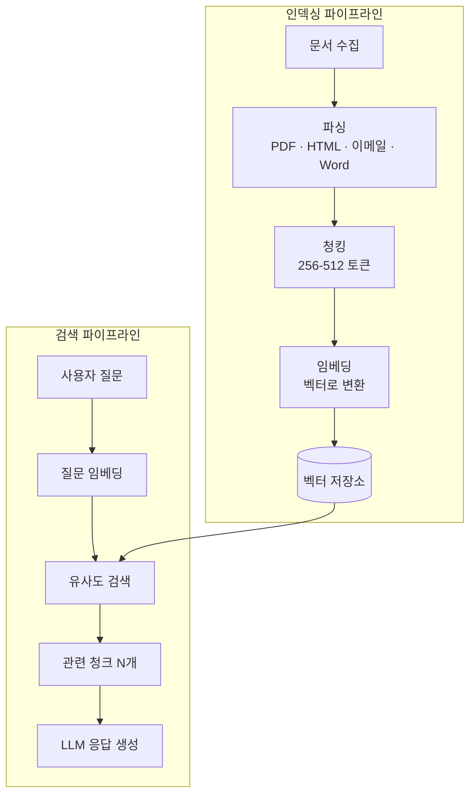

## 검색·지식 계층 선택 가이드

에이전트가 외부 지식에 접근하는 방법은 크게 세 가지로 구분됩니다.

| 방법 | 정의 | 적합한 상황 |
|------|------|-----------|
| **RAG** | 벡터 검색으로 관련 청크를 검색해 컨텍스트에 추가 | 문서 Q&A, FAQ, 정책 검색 |
| **GraphRAG** | 지식 그래프 기반 관계 검색 | 복잡한 관계 추론, 멀티홉 질문 |
| **시맨틱 인덱싱** | 의미 기반 구조화 인덱스 | 대규모 카탈로그, 제품/서비스 검색 |

## 기본 RAG 파이프라인

## 청킹 전략 비교

| 전략 | 방법 | 적합한 문서 유형 |
|------|------|--------------|
| **고정 크기** | N 토큰마다 분할 | 구조가 단순한 문서 |
| **의미 단위** | 문단/섹션 기준 | 구조화된 문서 (계약서, 매뉴얼) |
| **계층적** | 섹션 > 문단 > 문장 | 깊은 계층 구조 문서 |
| **슬라이딩 윈도우** | 겹침(overlap)을 두고 분할 | 맥락 연속성이 중요한 문서 |

**권장 청크 크기**: 256-512 토큰 (겹침 50-100 토큰)

## GraphRAG가 필요한 상황

일반 RAG의 한계:
- "A와 B의 공통점은?" → 두 문서의 관계를 파악 어려움
- "X에 영향을 미치는 모든 요소는?" → 멀티홉 추론 필요

GraphRAG 사용 신호:
- 엔티티 간 관계가 중요한 도메인 (의료, 법률, 공급망)
- 여러 문서를 가로지르는 추론이 필요
- "왜"를 설명해야 하는 답변 생성


GraphRAG는 일반 RAG보다 구축 비용이 5-10배 높습니다. 단순 검색 요구사항이라면 일반 RAG로 시작하세요.


## 문서 파싱 주의사항

| 문서 유형 | 도전 과제 | 권장 방법 |
|---------|---------|---------|
| PDF | 표/이미지/레이아웃 | PyMuPDF + OCR |
| Word/PPT | 메타데이터 손실 | python-docx |
| HTML | 불필요한 네비게이션 포함 | BeautifulSoup 정제 |
| 이메일 | 서명/RE:/FW: 노이즈 | 전처리 필터 |
| 스캔 이미지 | 텍스트 없음 | OCR + 멀티모달 LLM |
