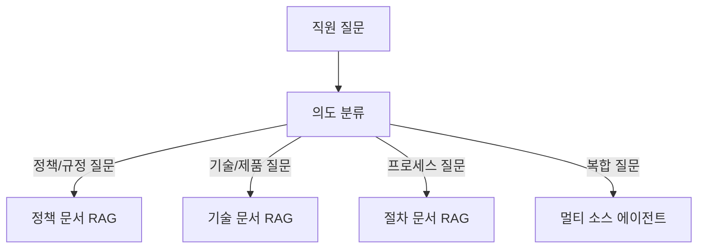

## 문제 정의

조직의 지식은 위키, 이메일, 문서, 슬랙, 회의록에 흩어져 있습니다. 직원들은 답을 찾는 데 평균 2.5시간/주를 씁니다.

**자동화 목표**: 내부 지식 통합 검색 + 질문-답변 에이전트

## 추천 아키텍처

**추천 패턴**: 라우팅 + RAG 기반 단일 에이전트

## 데이터 수집 전략

| 소스 | 수집 방법 | 업데이트 주기 |
|------|---------|------------|
| Confluence/Notion | API 크롤링 | 매일 |
| Google Drive | Drive API | 매일 |
| Slack 채널 | Slack Export API | 주간 |
| 이메일 (팀 메일링) | 이메일 API | 실시간 |
| 회의록 | 회의록 저장소 | 수동 업로드 |


**접근 제어 필수**: RAG 시스템이 사용자의 접근 권한을 반영해야 합니다. HR 문서는 HR팀만, 재무 문서는 재무팀만 검색 결과에 포함되어야 합니다.


## MVP 범위

**1차 PoC (3주)**
- 단일 소스 (Confluence 또는 Notion) 에서 Q&A
- 슬랙 봇 인터페이스
- 출처 URL과 함께 답변 제공

**2차 확장**
- 멀티 소스 통합
- 접근 권한 기반 필터링
- 답변 품질 피드백 수집

## KPI

| 지표 | 현재 | 목표 |
|------|------|------|
| 정보 검색 시간 | 2.5시간/주 | 0.5시간/주 |
| 셀프서비스 해결율 | 30% | 65% |
| 답변 만족도 | 측정 없음 | 4.0/5.0 |
