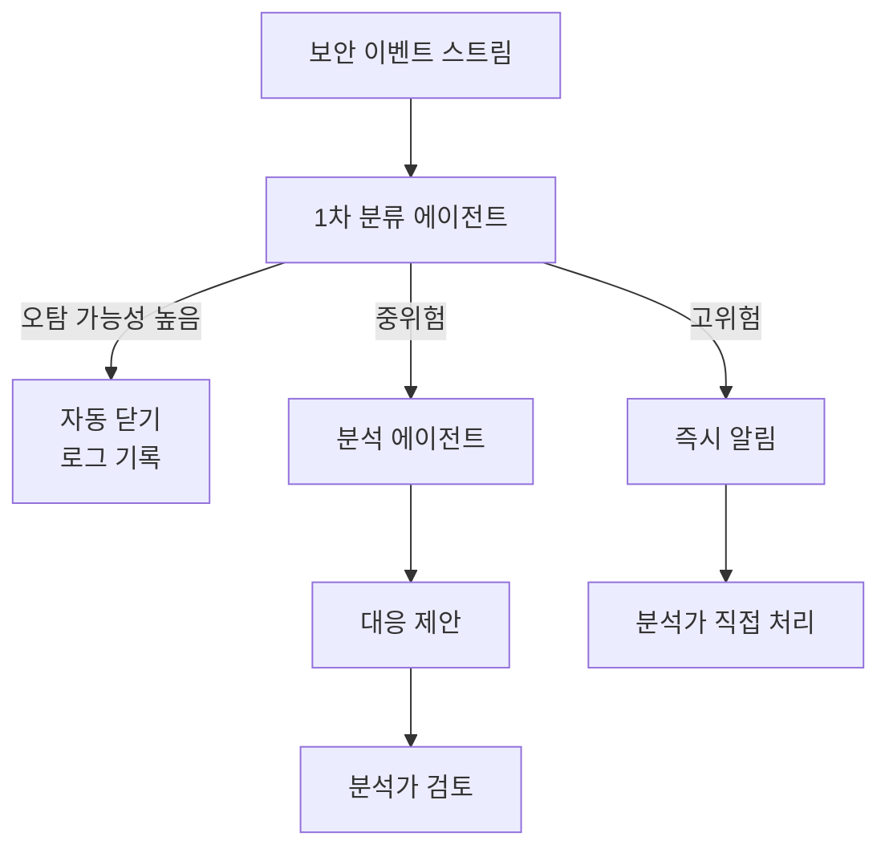

## 문제 정의

보안 운영팀(SOC)은 매일 수천 건의 보안 이벤트를 처리합니다. 대부분은 오탐(false positive)이지만 모두 검토해야 합니다. 실제 위협은 노이즈 속에 숨어 있습니다.

**자동화 목표**: 1차 트리아지 자동화 + 분석가가 고위험 이벤트에 집중

## 추천 아키텍처

**추천 패턴**: 라우팅 + 단일 에이전트


**보안 특수 원칙**: 에이전트의 자율 행동 범위를 최소화하세요. 차단·격리 같은 비가역 행동은 반드시 사람 승인을 받아야 합니다.


## 핵심 도구 목록

| 도구 | 기능 | 권한 수준 |
|------|------|---------|
| query_siem | SIEM 이벤트 조회 | 읽기 |
| lookup_threat_intel | 위협 인텔리전스 조회 | 읽기 |
| get_asset_info | 자산 정보 조회 | 읽기 |
| get_user_activity | 사용자 활동 로그 조회 | 읽기 |
| create_incident | 인시던트 티켓 생성 | 쓰기 |
| notify_analyst | 분석가 알림 발송 | 쓰기 |
| isolate_endpoint | 엔드포인트 격리 | **쓰기 + 승인 필수** |

## 위험 체크리스트

- [ ] 에이전트가 직접 차단/격리를 실행하지 않는가? (승인 필수)
- [ ] 조회 권한이 필요한 시스템에만 국한되어 있는가?
- [ ] 분석 결과에 증거 출처(SIEM 이벤트 ID, 로그 라인)가 포함되는가?
- [ ] 오탐 자동 닫기 이력이 감사 로그에 남는가?
- [ ] 에이전트 오류 시 인시던트가 누락되지 않는 폴백이 있는가?

## MVP 범위

**1차 PoC**
- 피싱 이메일 신고 자동 분류 및 1차 분석
- 알려진 악성 IP/도메인 접근 이벤트 자동 트리아지
- 분석 결과와 함께 인시던트 티켓 자동 생성

**제외 (2차)**
- 자동 격리·차단 실행
- 위협 헌팅
- 포렌식 분석

## KPI

| 지표 | 현재 | 목표 |
|------|------|------|
| 트리아지 시간 | 30분 | 3분 |
| 분석가당 일일 처리 건수 | 50건 | 150건 |
| 오탐 검토 시간 비율 | 70% | 30% |
| MTTD (탐지까지 시간) | 4시간 | 1시간 |
