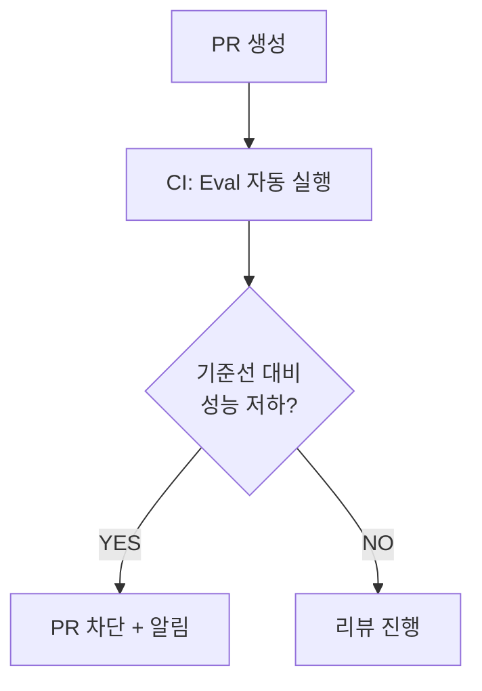
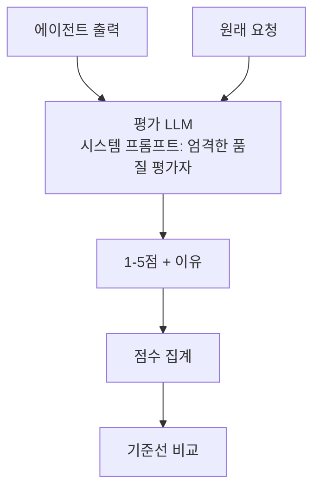

## Eval이 왜 중요한가

에이전트를 배포하기 전에 반드시 질문해야 합니다: **"이 에이전트가 잘 작동한다는 걸 어떻게 아는가?"**

프롬프트를 수정하거나 모델을 바꿀 때마다 성능이 의도치 않게 바뀔 수 있습니다. Eval 없이는 이를 알 방법이 없습니다.

## Eval 설계 시작 3단계

### 단계 1: 기준선(Baseline) 만들기

**20-50개의 골든 테스트 세트** 수집:
- 실제 사용 사례를 대표하는 입력
- 각 입력에 대한 기대 출력 또는 기대 행동
- 엣지 케이스 포함

```python
test_cases = [
    {
        "input": "환불 요청: 주문번호 12345, 3일 전 구매",
        "expected_action": "process_refund",
        "expected_checks": ["주문 조회 실행", "7일 이내 확인", "승인 요청"]
    },
    {
        "input": "환불 요청: 주문번호 67890, 15일 전 구매",
        "expected_action": "deny_refund",
        "expected_checks": ["주문 조회 실행", "7일 초과 확인", "거절 안내"]
    }
]
```

### 단계 2: 평가 지표 정의

에이전트 평가는 단순 정답률이 아닙니다.

| 지표 유형 | 예시 | 측정 방법 |
|---------|------|---------|
| **도구 선택 정확도** | 올바른 도구를 호출했는가? | 도구 호출 로그 비교 |
| **최종 출력 품질** | 답변이 적절한가? | LLM-as-judge |
| **지연 시간** | 응답까지 걸린 시간 | 타임스탬프 |
| **도구 호출 횟수** | 불필요한 호출 없는가? | 호출 카운트 |
| **오류율** | 실패한 비율 | 에러 로그 |

### 단계 3: 자동 회귀 테스트

코드가 바뀔 때마다 자동으로 eval을 실행합니다.



## 실패 케이스 수집 방법

프로덕션에서 실패 사례를 수집하는 채널:
1. **사용자 피드백**: 👍/👎 버튼, 재시도 행동
2. **자동 이상 감지**: 응답 길이, 도구 호출 패턴 이상
3. **샘플링**: 무작위로 프로덕션 대화 샘플링 후 수동 검토
4. **고위험 행동 모니터링**: 비가역 행동 전 스냅샷

## LLM-as-Judge 패턴

다른 LLM을 평가자로 사용하는 방법:




LLM-as-Judge는 편향이 있을 수 있습니다. 중요한 평가에는 반드시 사람 검토를 병행하세요.

