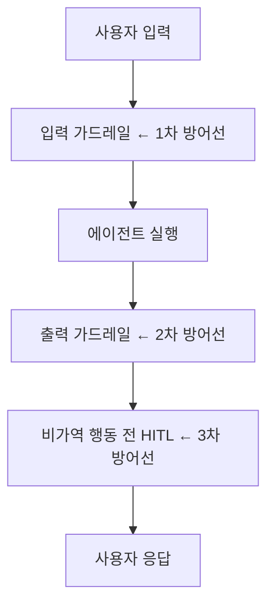
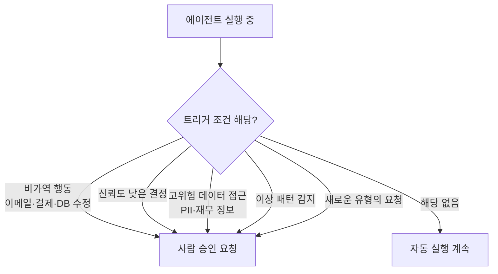

## 가드레일이 필요한 이유

에이전트는 예측 불가능한 입력을 받고, 예측 불가능한 행동을 할 수 있습니다.
가드레일은 **허용 범위 안에서만 동작하도록 보장**하는 안전장치입니다.

## 가드레일 아키텍처

## 입력 가드레일

**목적**: 악의적이거나 부적절한 입력 차단

| 가드레일 유형 | 구현 방법 | 예시 |
|------------|---------|------|
| **프롬프트 인젝션 탐지** | 패턴 매칭 + LLM 분류기 | "이전 지침을 무시하고..." 차단 |
| **PII 탐지** | 정규식 + NER 모델 | 주민번호, 카드번호 마스킹 |
| **주제 제한** | 분류기 | 업무 외 주제 거절 |
| **Rate limiting** | 요청 빈도 제한 | 1분에 10회 이상 차단 |

## 출력 가드레일

**목적**: 에이전트가 부적절한 응답을 전달하기 전 차단

| 가드레일 유형 | 구현 방법 |
|------------|---------|
| **PII 노출 방지** | 출력에서 민감 정보 탐지 후 마스킹 |
| **정책 준수 확인** | 응답이 회사 정책과 충돌하는지 LLM 검토 |
| **사실 확인** | RAG 기반 출처와 비교 검증 |
| **형식 검증** | 기대 구조(JSON 등)로 파싱 가능한지 확인 |

## Human-in-the-Loop 트리거 조건

이 조건 중 하나라도 해당하면 자동 실행 대신 사람 승인을 요청합니다:

## 가드레일 체크리스트

- [ ] 프롬프트 인젝션 방어가 있는가?
- [ ] 입출력에서 PII가 로깅/노출되지 않는가?
- [ ] 비가역 행동 전 승인 흐름이 있는가?
- [ ] 거절 시 사용자에게 명확한 안내가 있는가?
- [ ] 가드레일 발동 이력이 기록되는가?
- [ ] 가드레일 우회 시도가 알림으로 연결되는가?
