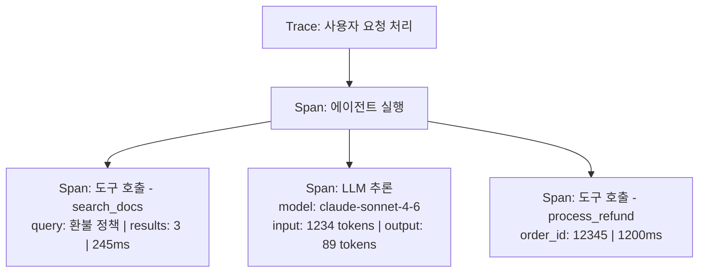
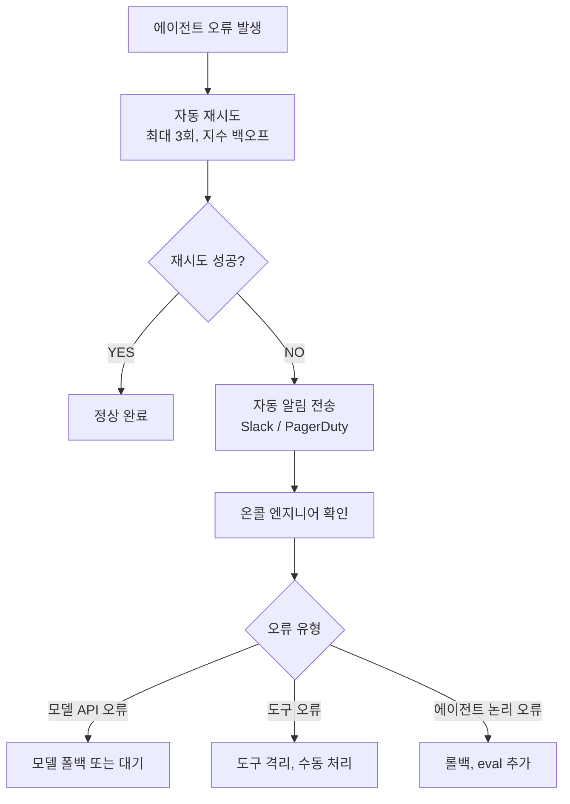

## 에이전트 관측성의 특수성

일반 소프트웨어 모니터링과 달리, 에이전트는 **비결정론적**입니다. 같은 입력에도 다른 도구 경로를 선택할 수 있습니다.


**2026년 현재**: 어떤 프로토콜도 구조화 로깅이나 OpenTelemetry 통합을 강제하지 않습니다. 모든 프로덕션 팀이 관측성을 독립적으로 구축하고 있습니다.


## 추적해야 할 핵심 지표

### 성능 지표

| 지표 | 설명 | 알림 임계값 |
|------|------|-----------|
| **레이턴시 (p50/p95/p99)** | 응답까지 걸린 시간 | p95 > 10초 |
| **도구 호출 횟수** | 태스크당 평균 도구 호출 | 평균 +50% 이상 |
| **성공률** | 오류 없이 완료된 비율 | < 95% |
| **재시도율** | 도구 실패 후 재시도 비율 | > 20% |

### 비용 지표

| 지표 | 설명 |
|------|------|
| **태스크당 토큰 사용량** | 입력 + 출력 토큰 합계 |
| **태스크당 비용** | 모델 API 비용 |
| **도구 호출 비용** | 외부 API 비용 |
| **일간/월간 총 비용** | 예산 추적 |

## OpenTelemetry 기반 트레이싱

에이전트 실행을 추적하는 권장 구조:

## 비용 최적화 전략

### 1. 프롬프트 캐싱
반복되는 시스템 프롬프트나 문서를 캐시합니다.

### 2. 모델 라우팅
복잡도에 따라 모델을 선택합니다:
- 단순 분류 → 소형 모델
- 복잡 추론 → 대형 모델

### 3. 도구 호출 최적화
- 중복 도구 호출 탐지 및 결과 재사용
- 병렬 도구 호출로 지연 감소

## 장애 대응 런북

